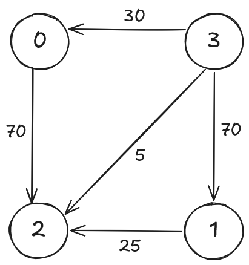
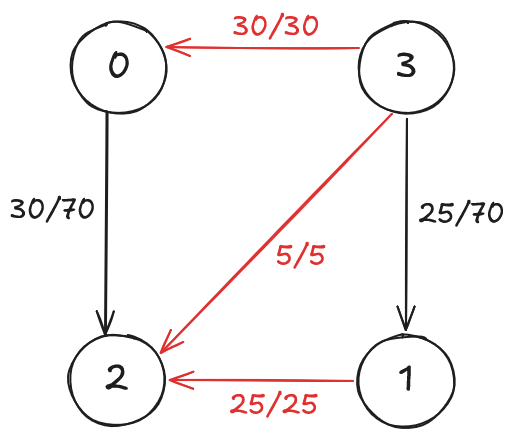
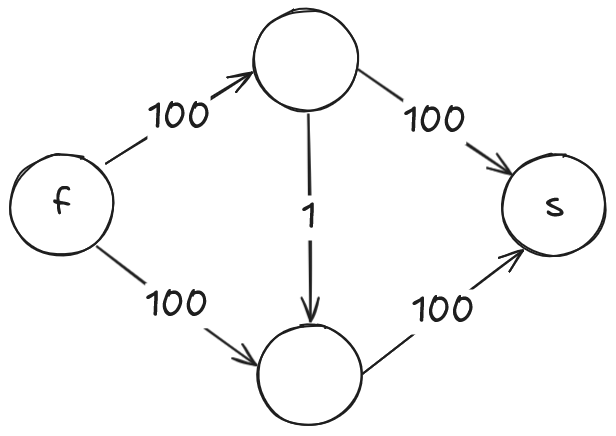
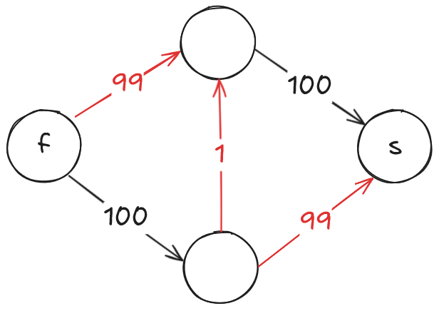

# Fluxo máximo

## Motivação

Seja um grafo $G = (V, E)$ direcionado com pesos nas arestas. Dado dois vértices $f, s \in V$, onde $f$ é a fonte e $s$ é o sumidouro, quanto de peso podemos levar da fonte ao sumidouro? Por exemplo, considere o seguinte grafo:



Nesse grafo, se consideramos o 3 como fonte e o 2 como sumidouro, o peso que podemos transmitir de 3 até 2 é $30 + 5 + 25 = 60$. Esses são os limites do quanto se pode passar, como mostrado na figura abaixo.



Podemos pensar em cada aresta como canos com determinada capacidade e o problema a resolver sendo o quanto de água pode sair da fonte e cair no sumidouro. Por isso, esse problema é chamado de **fluxo máximo**.

## Algoritmo de Ford-Fulkerson

O algoritmo de Ford-Fulkerson se propõe a resolver esse problema, sendo o Ford o mesmo Ford que inventou o [algoritmo de Bellman-Ford](../../../base-teorica/grafos/caminho-minimo/README.md#algoritmo-de-bellman-ford) para caminhos mínimos em grafos com pesos negativos.

Esse algoritmo funciona primeiramente criando um grafo auxiliar ao grafo que se quer descobrir o fluxo máximo. Esse grafo auxiliar conta com, além das arestas do grafo original, arestas no sentido contrário às arestas originais com o mesmo peso de suas respectivas arestas. Ou seja, seria um grafo com arestas repetidas em ambas as direções com mesmo valor.

Após isso, vamos atuar somente no grafo auxiliar e repetir iterativamente o seguinte processo:

* Enquanto houver um caminho da fonte ao sumidouro
    * Encontra a aresta de menor peso nesse caminho
    * Diminui esse peso de todas as arestas do caminho da fonte ao sumidouro
        * Fazer isso vai fazer com que a aresta de menor peso tenha peso 0, o que inviabiliza agora esse caminho
    * Aumenta esse peso de todas as arestas do caminho do sumidouro até a fonte, ou seja, o caminho oposto
    * Adiciona ao resultado (fluxo máximo) o valor desse peso
        * Com isso, sabemos que esse peso pode ser passado da fonte até o sumidouro

Se a cada passo achamos um caminho e inviabilizamos ele, então eventualmente não vão mais existir caminhos e o algoritmo vai terminar.

Remover o peso mínimo de cada caminho é fácil de entender, mas a razão pela qual precisa-se adicionar esse mesmo peso mínimo no caminho reverso é porque o processo de escolher os caminhos é um método guloso (sempre tentamos transferir o máximo que dá de cada caminho), por isso, se esse processo estiver errado, o algoritmo consegue se auto-regular com os caminhos reversos e ajeitar os fluxos de acordo.

O motivo de não termos uma seção de implementação desse algoritmo é que, dependendo do grafo a ser aplicado, esse algoritmo pode ser muito lento. Por exemplo, imagine que o algoritmo seja aplicado no seguinte grafo:



Se o caminho encontrado da fonte até o sumidouro é o caminho $100 \rightarrow 1 \rightarrow 100$, então ao final das somas teremos algo mais ou menos assim



Aqui podemos ver que vão demorar muitas e muitas iterações para passar todo o fluxo, o que torna um algoritmo inviável no geral, já que não podemos garantir que não deparemos com esse tipo de grafo.

## Algoritmo de Edmond-Karp

O algoritmo de Edmond-Karp trabalha com a mesma ideia do Ford-Fulkerson, mas com uma estratégia para atenuar o pior caso, usando [busca em largura](../percursos/README.md#busca-em-largura) para encontrar os menores caminhos da fonte até o sumidouro. A estratégia aqui é priorizar caminhos que passem por menos arestas (daí que vem a necessidade de usar a busca em largura) para minimizar os casos que deixariam o algoritmo mais lento.

### Implementação

Na implementação, um detalhe que precisamos prestar atenção é que precisamos ser capazes de reconstituir o menor caminho para conseguir fazer as mudanças nas arestas envolvidas (remover no fluxo e adicionar no contra fluxo). Para isso, usamos um vetor auxiliar para guardar o pai do vértice visitado para poder voltar com o caminho depois. Essa reconstituição do caminho vai se provar útil quando quisermos ver qual o menor fluxo que dá para passar num caminho, que é a menor entre todas as arestas envolvidas.

#### C++

```cpp
vector<map<int, int>> adaptaGrafo(vector<map<int, int>> &grafo) {
  vector<map<int, int>> resposta =
      vector<map<int, int>>(grafo.size(), map<int, int>());

  int n = grafo.size();
  for (int i = 0; i < n; ++i) {
    int m = grafo[i].size();
    for (map<int, int>::iterator it = grafo[i].begin(); it != grafo[i].end();
         ++it) {
      resposta[i][it->first] = it->second;
      resposta[it->first][i] = it->second;
    }
  }

  return resposta;
}

pair<vector<int>, int> encontraCaminho(vector<map<int, int>> &grafo, int fonte,
                                       int sumidouro) {
  queue<int> fila;
  vector<int> pai(grafo.size(), -1);
  vector<bool> visitado(grafo.size(), false);

  visitado[fonte] = true;
  fila.push(fonte);

  while (!fila.empty()) {
    int u = fila.front();
    fila.pop();

    if (u == sumidouro) {
      break;
    }

    for (map<int, int>::iterator it = grafo[u].begin(); it != grafo[u].end();
         ++it) {
      int v = it->first;
      int peso = it->second;

      if (peso > 0 && !visitado[v]) {
        visitado[v] = true;
        fila.push(v);
        pai[v] = u;
      }
    }
  }

  if (!visitado[sumidouro]) {
    return pair<vector<int>, int>(vector<int>(), 0);
  }

  vector<int> resposta;
  int fluxo = INFINITO;

  int v = sumidouro;
  while (v != fonte) {
    resposta.push_back(v);
    fluxo = min(fluxo, grafo[pai[v]][v]);

    v = pai[v];
  }
  resposta.push_back(fonte);

  return pair<vector<int>, int>(resposta, fluxo);
}

int fluxoMaximo(vector<map<int, int>> &grafo, int fonte, int sumidouro) {
  vector<map<int, int>> novo_grafo = adaptaGrafo(grafo);

  int resposta = 0;

  while (true) {
    pair<vector<int>, int> caminho =
        encontraCaminho(novo_grafo, fonte, sumidouro);

    int fluxo = caminho.second;
    if (fluxo == 0) {
      break;
    }
    resposta += fluxo;

    for (int i = caminho.first.size() - 1; i > 0; --i) {
      int u = caminho.first[i];
      int v = caminho.first[i - 1];

      novo_grafo[u][v] -= fluxo;
      novo_grafo[v][u] += fluxo;
    }
  }

  return resposta;
}
```

## Problemas

* [1362 - Minha Camiseta Me Serve](../../../problemas/grafos/1362/README.md)